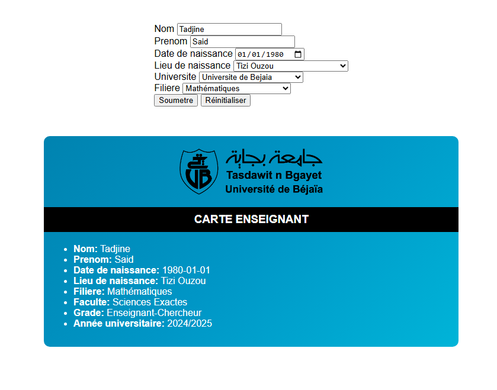

# 🎓 Univ Card Generator


A university card generator built with vanilla HTML, CSS, and JavaScript.  
The form allows users to enter personal details, select their university and major, and receive a dynamically generated student or teacher card.

## 🚀 Live Demo

👉 [Click here to view the demo](https://saidT-dev.github.io/Univ-Card-Generator/)

---

## 📸 Preview

> _You can replace this with a screenshot or GIF of the app interface._



---

## 📦 Features

-   Age and grade calculation based on birth date
-   Internal/external student status based on birthplace and university
-   Faculty deduction from selected major
-   Card type (Student / Teacher) based on age
-   Dynamic form validation
-   University-specific card image and background

---

## 🏫 Faculties by Major

```js
const faculties = {
  se: ['mat', 'inf'],
  st: ['aut', 'tel'],
  ll: ['fra', 'ang']
};

---

## 📁 Folder Structure
Univ-Card-Generator/
├── index.html
├── style.css
├── script.js
├── assets/
│   ├── bejaia.png
│   ├── tizi.png
│   └── preview.png
└── README.md

---

##🛠️ Built With
 - HTML5
 - CSS3
 - JavaScript (Vanilla)
```
